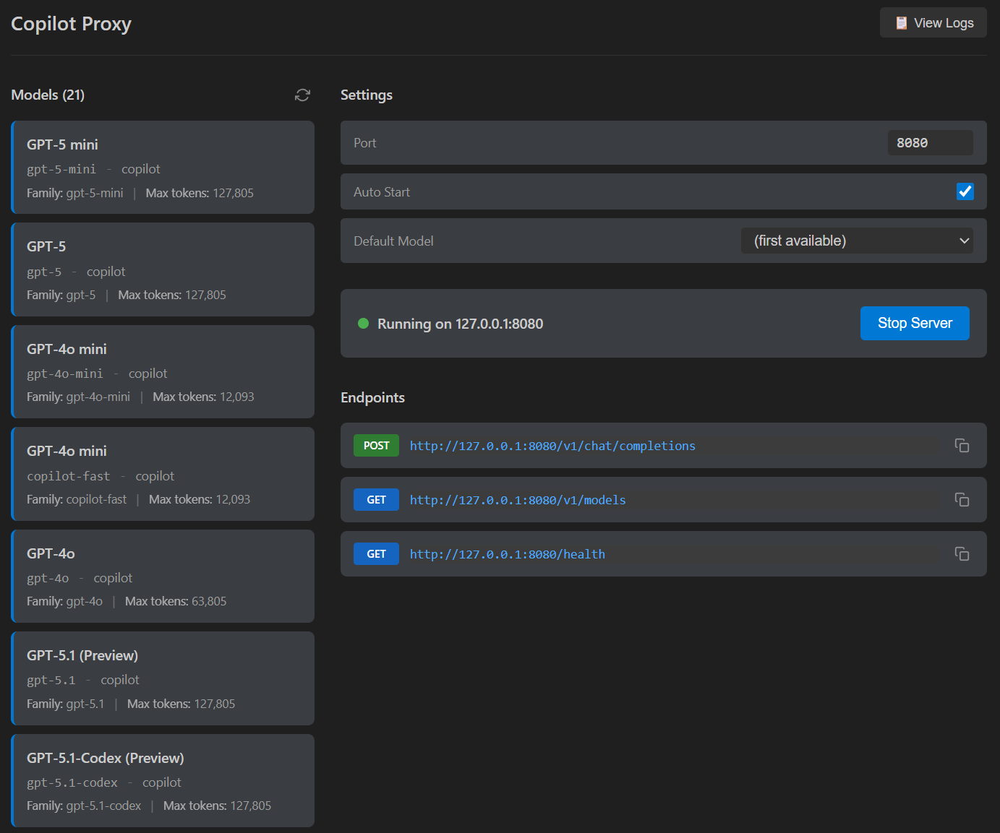

# Copilot Proxy

> **Turn your GitHub Copilot subscription into an OpenAI-compatible API** - Use any Copilot model with your favorite AI tools, frameworks, and applications without leaving VS Code.

## About

Copilot Proxy is a VS Code extension that exposes GitHub Copilot's language models through a local OpenAI-compatible API server. This lets you leverage your existing Copilot subscription to power external applications, scripts, and tools - no additional API costs, just your Copilot subscription.

Perfect for developers who want to use Copilot's models in custom workflows, automation scripts, or with tools that expect an OpenAI-compatible endpoint.

<p align="center">
  
</p>

## Features

- **OpenAI-compatible API**: Exposes endpoints that work with any OpenAI-compatible client
- **All Copilot Models**: Access any model available through your GitHub Copilot subscription
- **Streaming Support**: Full support for streaming responses (SSE)
- **Auto-start**: Optionally starts automatically when VS Code opens
- **Status Bar Integration**: Shows server status, port, and model count at a glance
- **Interactive Status Panel**: Visual dashboard showing server status, available models, and endpoint URLs with copy buttons
- **Output Logging**: Real-time logging of requests, responses, and errors to VS Code's Output panel
- **Flexible Model Matching**: Match models by exact ID, family name, or partial name
- **CORS Support**: Built-in CORS headers for browser-based applications

## Prerequisites

1. **GitHub Copilot Subscription** - Individual, Business, or Enterprise
2. **VS Code** with the GitHub Copilot extension installed and authenticated

## Installation

### From Source

1. Clone this repository
2. Run `npm install`
3. Run `npm run compile`
4. Press F5 to launch the extension in a new VS Code window

### Manual Install

1. Run `npm run compile`
2. Package with `vsce package` (requires `npm install -g @vscode/vsce`)
3. Install the generated `.vsix` file in VS Code

## Usage

### Starting the Server

The server starts automatically by default. You can also:

- Use Command Palette: `Copilot Proxy: Start Server`
- Click the status bar item to open the status panel

### Status Bar

The status bar shows the current server state:

- `$(radio-tower) Copilot Proxy: 8080` - Server running on port 8080
- `$(circle-slash) Copilot Proxy: Off` - Server stopped

Click the status bar item to open the interactive status panel.

### Status Panel

The status panel provides:

- **Server Status**: Visual indicator showing if the server is running
- **Start/Stop Button**: Quick toggle for the server
- **Model List**: All available Copilot models with details (name, ID, vendor, family, max tokens)
- **Endpoint URLs**: Clickable URLs with copy buttons for easy integration

### Output Logging

View real-time logs in VS Code's Output panel (select "Copilot Proxy" from the dropdown):

- **Startup Info**: Extension version, port, endpoint URL, available models with token limits
- **Request Logging**: Message count, character count, estimated tokens, model selection, streaming mode
- **Response Logging**: Response size in characters and estimated tokens
- **Error Logging**: All errors with timestamps and details

Example output:

```
[10:30:15] === Copilot Proxy Starting ===
[10:30:15] Extension version: 0.0.1
[10:30:15] Server started on port 8080
[10:30:15] Endpoint: http://localhost:8080/v1/chat/completions
[10:30:15]   Model: GPT-4o (gpt-4o) - max 128000 tokens
[10:30:15]   Model: Claude 3.5 Sonnet (claude-3.5-sonnet) - max 16384 tokens
[10:30:20] Request: 3 messages, ~1500 chars (~375 tokens), model: gpt-4o, stream: true
[10:30:20] Using model: GPT-4o (gpt-4o), max input: 128000 tokens
[10:30:22] Response (stream): ~800 chars (~200 tokens)
```

## API Endpoints

Once running, the following endpoints are available:

### POST `/v1/chat/completions`

OpenAI-compatible chat completions endpoint.

```bash
curl http://localhost:8080/v1/chat/completions \
  -H "Content-Type: application/json" \
  -d '{
    "model": "claude-3.5-sonnet",
    "messages": [{"role": "user", "content": "Hello!"}],
    "stream": false
  }'
```

**Request Body:**

- `model` (optional): Model ID or partial name to match. If omitted, uses default model setting or first available.
- `messages`: Array of chat messages with `role` (`system`, `user`, `assistant`) and `content`
- `stream` (optional): Set to `true` for streaming responses (SSE format)
- `temperature` (optional): Accepted but not forwarded to VS Code API
- `max_tokens` (optional): Accepted but not forwarded to VS Code API

**Response (non-streaming):**

```json
{
  "id": "chatcmpl-abc123",
  "object": "chat.completion",
  "created": 1234567890,
  "model": "copilot-claude-3.5-sonnet",
  "choices": [{
    "index": 0,
    "message": {
      "role": "assistant",
      "content": "Hello! How can I help you today?"
    },
    "finish_reason": "stop"
  }],
  "usage": {
    "prompt_tokens": 0,
    "completion_tokens": 0,
    "total_tokens": 0
  }
}
```

**Response (streaming):**

Server-Sent Events (SSE) format compatible with OpenAI's streaming API.

### GET `/v1/models`

List available models.

```bash
curl http://localhost:8080/v1/models
```

**Response:**

```json
{
  "object": "list",
  "data": [
    {
      "id": "copilot-claude-3.5-sonnet",
      "object": "model",
      "created": 1234567890,
      "owned_by": "copilot",
      "name": "Claude 3.5 Sonnet",
      "family": "claude-3.5-sonnet",
      "version": "1.0",
      "maxInputTokens": 16384
    }
  ]
}
```

### GET `/health`

Health check endpoint.

```bash
curl http://localhost:8080/health
```

**Response:**

```json
{
  "status": "ok",
  "models_available": 5
}
```

## Configuration

Settings available in VS Code Settings (search for "Copilot Proxy"):

| Setting | Default | Description |
|---------|---------|-------------|
| `copilotProxy.port` | `8080` | Port number for the proxy server |
| `copilotProxy.autoStart` | `true` | Automatically start when VS Code opens |
| `copilotProxy.defaultModel` | `""` | Default model when not specified in request (leave empty for first available) |

## Using with External Tools

### With Python (OpenAI client)

```python
from openai import OpenAI

client = OpenAI(
    base_url="http://localhost:8080/v1",
    api_key="not-needed"  # Any value works
)

response = client.chat.completions.create(
    model="claude-3.5-sonnet",
    messages=[{"role": "user", "content": "Hello!"}]
)
print(response.choices[0].message.content)
```

### With Python (streaming)

```python
from openai import OpenAI

client = OpenAI(
    base_url="http://localhost:8080/v1",
    api_key="not-needed"
)

stream = client.chat.completions.create(
    model="gpt-4o",
    messages=[{"role": "user", "content": "Write a short poem"}],
    stream=True
)

for chunk in stream:
    if chunk.choices[0].delta.content:
        print(chunk.choices[0].delta.content, end="")
```

### With curl (streaming)

```bash
curl http://localhost:8080/v1/chat/completions \
  -H "Content-Type: application/json" \
  -d '{
    "model": "claude-3.5-sonnet",
    "messages": [{"role": "user", "content": "Write a haiku"}],
    "stream": true
  }'
```

### With Node.js

```javascript
const response = await fetch('http://localhost:8080/v1/chat/completions', {
    method: 'POST',
    headers: { 'Content-Type': 'application/json' },
    body: JSON.stringify({
        model: 'claude-3.5-sonnet',
        messages: [{ role: 'user', content: 'Hello!' }]
    })
});
const data = await response.json();
console.log(data.choices[0].message.content);
```

### With LangChain

```python
from langchain_openai import ChatOpenAI

llm = ChatOpenAI(
    base_url="http://localhost:8080/v1",
    api_key="not-needed",
    model="claude-3.5-sonnet"
)

response = llm.invoke("What is the capital of France?")
print(response.content)
```

## Commands

- `Copilot Proxy: Start Server` - Start the proxy server
- `Copilot Proxy: Stop Server` - Stop the proxy server
- `Copilot Proxy: Show Status` - Open the interactive status panel

## Limitations

- **System Messages**: VS Code LM API doesn't have a system role - system messages are converted to user messages
- **Token Counts**: Token counts in responses are always 0 (VS Code API doesn't expose this)
- **Temperature/Max Tokens**: These parameters are accepted but not forwarded to the underlying API

## Troubleshooting

### "No language models available"

- Ensure GitHub Copilot extension is installed
- Ensure you're signed into GitHub with Copilot access
- Try running `GitHub Copilot: Sign In` from Command Palette
- Check the Output panel for error details

### "Port already in use"

- Change the port in settings (`copilotProxy.port`)
- Or stop whatever is using that port

### Model not found

- Use `GET /v1/models` to see available models
- Model matching is flexible: `claude`, `sonnet`, or `claude-3.5-sonnet` all work
- Check the Output panel to see which model was selected

### Check the Logs

Open VS Code's Output panel and select "Copilot Proxy" from the dropdown to see detailed logs including:

- All errors with timestamps
- Request/response details
- Model selection information

## License

MIT
