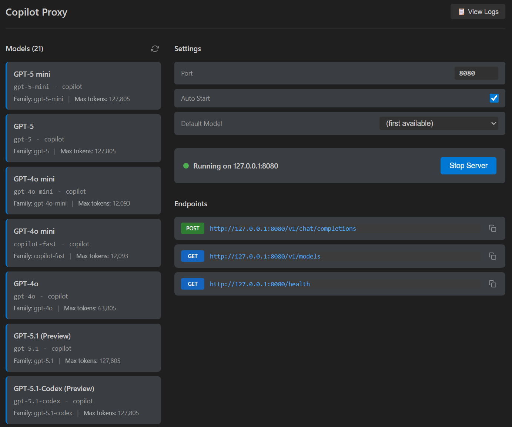
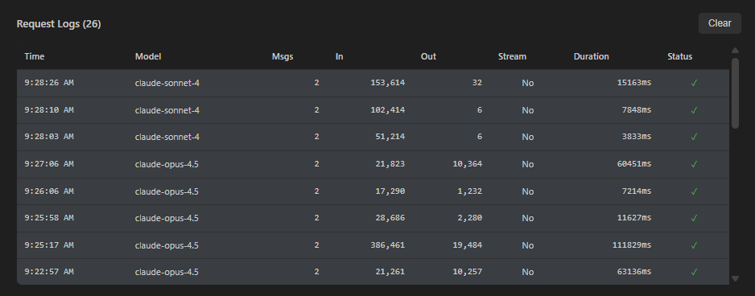
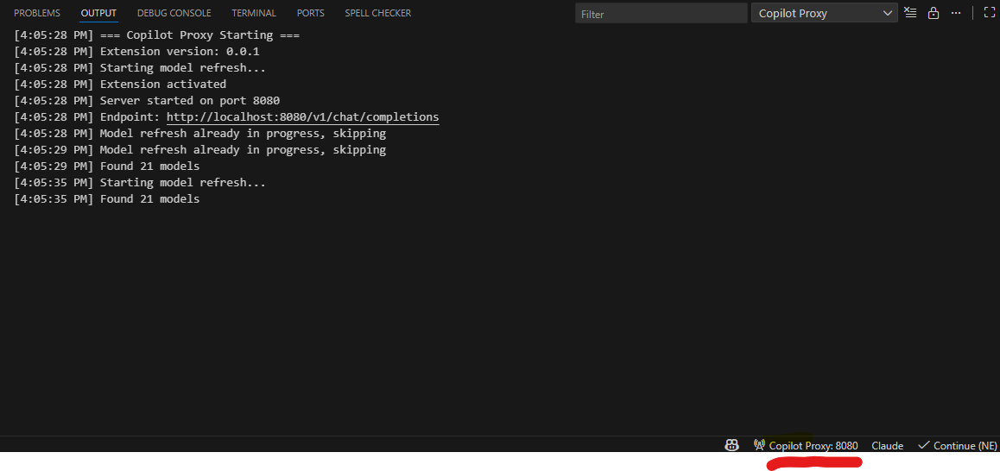

# Copilot Proxy

> **Turn your GitHub Copilot subscription into an OpenAI and Anthropic-compatible API** - Use any Copilot model with your favorite AI tools, frameworks, and applications without leaving VS Code.

## About

Copilot Proxy is a VS Code extension that exposes GitHub Copilot's language models through local OpenAI-compatible and Anthropic-compatible API servers. This lets you leverage your existing Copilot subscription to power external applications, scripts, and tools - no additional API costs, just your Copilot subscription.

Perfect for developers who want to use Copilot's models in custom workflows, automation scripts, or with tools that expect an OpenAI or Anthropic-compatible endpoint - including **Claude Code**.

<p align="center">
  
</p>

<p align="center">
  
</p>

<p align="center">
  
</p>

<p align="center">
  
</p>

## Features

- **OpenAI-compatible API**: Exposes endpoints that work with any OpenAI-compatible client
- **Anthropic-compatible API**: Exposes the `/v1/messages` endpoint for Anthropic SDK clients and Claude Code
- **All Copilot Models**: Access any model available through your GitHub Copilot subscription
- **Tool/Function Calling**: Full support for OpenAI-compatible tool calling with pass-through or auto-execute modes
- **VS Code Tools Integration**: Use VS Code's registered tools (from extensions and MCP servers) in your requests
- **Streaming Support**: Full support for streaming responses (SSE)
- **Auto-start**: Optionally starts automatically when VS Code opens
- **Status Bar Integration**: Shows server status, port, and model count at a glance
- **Interactive Status Panel**: Visual dashboard showing server status, available models, and endpoint URLs with copy buttons
- **Output Logging**: Real-time logging of requests, responses, and errors to VS Code's Output panel
- **Flexible Model Matching**: Match models by exact ID, family name, or partial name
- **CORS Support**: Built-in CORS headers for browser-based applications

## Prerequisites

1. **GitHub Copilot Subscription** - Individual, Business, or Enterprise
2. **VS Code** with the GitHub Copilot extension installed and authenticated

## Security / Local Setup

> **This extension is intended for isolated local development use only** - it is not designed, hardened, or supported as a public-facing or network-exposed service. Do not expose it beyond your own machine.

### 1. Set your proxy bearer token (required)

Every request to the proxy (except `GET /health`) must be authenticated. Set a token before first use:

1. Open the Command Palette (`Ctrl+Shift+P` / `Cmd+Shift+P`)
2. Run **`Copilot Proxy: Set Proxy Token`** (`copilot-proxy.setProxyToken`)
3. Enter a token value when prompted

The token is stored using VS Code's **SecretStorage** API - it is never written to `settings.json`, workspace files, or plaintext on disk. If no token has been set, the server denies all authenticated requests by default (deny-by-default), returning `401 Unauthorized`.

Include the token on every request:

```
Authorization: Bearer <your-token>
```

Missing or invalid tokens return `401 Unauthorized`. `GET /health` is exempt from authentication (useful for lightweight liveness checks).

### 2. Localhost-only binding

The server binds to `127.0.0.1` (loopback) only. This is not configurable - there is no setting to bind to `0.0.0.0` or any other network interface. The port itself remains configurable via `copilotProxy.port`.

### 3. CORS - explicit allowlist, no wildcards

By default, `copilotProxy.allowedOrigins` is an empty array, meaning **no browser origins are allowed** and no `Access-Control-Allow-Origin` header is returned unless a request's `Origin` matches an entry in the allowlist. To permit a trusted local web tool (e.g., a local dev server on `http://localhost:3000`), add its exact origin to the setting:

```json
{
  "copilotProxy.allowedOrigins": ["http://localhost:3000"]
}
```

Wildcards (`*`) are not supported and cannot be configured - only exact, explicitly listed origins are ever echoed back.

### 4. Model access is tied to your VS Code Copilot session

All model calls go through the VS Code `vscode.lm` API, which uses whichever GitHub account **VS Code itself** is currently signed into for Copilot. This is independent of, and unrelated to, any account used by the `gh` CLI (`gh auth login`) on the same machine.

### 5. Logging is metadata-only

By default, and always, logging captures **metadata only** (message counts, character counts, estimated tokens, tool-call argument character counts, bounded error categories) - never raw prompt/response content or raw exception text. There is no raw/verbose logging mode; this cannot be re-enabled via settings.

### 6. Tool-execution gating

- `copilotProxy.allowAutoToolExecution` (default: `false`) gates whether the proxy is permitted to automatically execute VS Code tools on a client's behalf. Clients cannot self-enable auto-execution by setting `tool_execution: "auto"` in a request if this setting is `false` - the request falls back to pass-through mode.
- `max_tool_rounds` is bounded to the range **1-100** (previously `0` meant "unlimited"; that behavior has been removed). Out-of-range values return `400 Bad Request`.

## Installation

### Manual Install - Preferred

1. Run `npm run compile`
2. Package with `vsce package` (requires `npm install -g @vscode/vsce`)
3. Install the generated `.vsix` file in VS Code

### From Source - debugging/launching may not work

1. Clone this repository
2. Run `npm install`
3. Run `npm run compile`
4. Press F5 to launch the extension in a new VS Code window


## Usage

### Starting the Server

The server starts automatically by default. You can also:

- Use Command Palette: `Copilot Proxy: Start Server`
- Click the status bar item to open the status panel

### Status Bar

The status bar shows the current server state:

- `$(radio-tower) Copilot Proxy: 8080` - Server running on port 8080
- `$(circle-slash) Copilot Proxy: Off` - Server stopped

Click the status bar item to open the interactive status panel.

### Status Panel

The status panel provides:

- **Server Status**: Visual indicator showing if the server is running
- **Start/Stop Button**: Quick toggle for the server
- **Model List**: All available Copilot models with details (name, ID, vendor, family, max tokens)
- **Endpoint URLs**: Clickable URLs with copy buttons for easy integration

### Output Logging

View real-time logs in VS Code's Output panel (select "Copilot Proxy" from the dropdown):

- **Startup Info**: Extension version, port, endpoint URL, available models with token limits
- **Request Logging**: Message count, character count, estimated tokens, model selection, streaming mode
- **Response Logging**: Response size in characters and estimated tokens
- **Error Logging**: All errors with timestamps and details

Example output:

```
[10:30:15] === Copilot Proxy Starting ===
[10:30:15] Extension version: 0.0.2
[10:30:15] Server started on 127.0.0.1:8080
[10:30:15] Endpoint: http://127.0.0.1:8080/v1/chat/completions (OpenAI)
[10:30:15] Endpoint: http://127.0.0.1:8080/v1/messages (Anthropic)
[10:30:15]   Model: GPT-4o (gpt-4o) - max 128000 tokens
[10:30:15]   Model: Claude 3.5 Sonnet (claude-3.5-sonnet) - max 16384 tokens
[10:30:20] Request: 3 messages, ~1500 chars (~375 tokens), model: gpt-4o, stream: true
[10:30:20] Using model: GPT-4o (gpt-4o), max input: 128000 tokens
[10:30:22] Response (stream): ~800 chars (~200 tokens)
```

## Using with External Tools

### Example Scripts

Two Python examples are included in the `examples/` folder:

#### Simple Example (`vscode_llm_example_simple.py`)

A straightforward example for getting started quickly. Demonstrates basic API calls with aiohttp and runs three demo prompts (simple question, code generation, creative writing).

```bash
pip install aiohttp
py examples/vscode_llm_example_simple.py
```

#### Full Example with Retry and Fallback (`vscode_llm_example_full.py`)

A production-ready example with robust error handling:

- **Retry logic** - 3 retries with exponential backoff (2s, 4s, 8s)
- **Custom exceptions** - `ContentFilteredError`, `EmptyResponseError`, `VSCodeLLMConnectionError`
- **Anthropic fallback** - Automatically falls back to direct Anthropic API when VS Code LLM is unavailable
- **Configurable** - Environment variables for endpoint, fallback toggle, and API key

```bash
pip install aiohttp anthropic
export ANTHROPIC_API_KEY="sk-..."  # Optional: enables fallback
py examples/vscode_llm_example_full.py
```

| Environment Variable | Default | Description |
|---------------------|---------|-------------|
| `VSCODE_LLM_ENDPOINT` | `http://127.0.0.1:8080/v1/chat/completions` | Proxy endpoint URL |
| `VSCODE_LLM_FALLBACK` | `true` | Enable/disable Anthropic fallback |
| `ANTHROPIC_API_KEY` | (none) | Required for fallback support |

### With Python (OpenAI client)

```python
from openai import OpenAI

client = OpenAI(
    base_url="http://127.0.0.1:8080/v1",
    api_key="<your-proxy-token>"  # Set via Command Palette: Copilot Proxy: Set Proxy Token
)

response = client.chat.completions.create(
    model="claude-3.5-sonnet",
    messages=[{"role": "user", "content": "Hello!"}]
)
print(response.choices[0].message.content)
```

### With Python (streaming)

```python
from openai import OpenAI

client = OpenAI(
    base_url="http://127.0.0.1:8080/v1",
    api_key="<your-proxy-token>"  # Set via Command Palette: Copilot Proxy: Set Proxy Token
)

stream = client.chat.completions.create(
    model="gpt-4o",
    messages=[{"role": "user", "content": "Write a short poem"}],
    stream=True
)

for chunk in stream:
    if chunk.choices[0].delta.content:
        print(chunk.choices[0].delta.content, end="")
```

### With curl (streaming)

```bash
curl http://127.0.0.1:8080/v1/chat/completions \
  -H "Content-Type: application/json" \
  -H "Authorization: Bearer <your-proxy-token>" \
  -d '{
    "model": "claude-3.5-sonnet",
    "messages": [{"role": "user", "content": "Write a haiku"}],
    "stream": true
  }'
```

### With Node.js

```javascript
const response = await fetch('http://127.0.0.1:8080/v1/chat/completions', {
    method: 'POST',
    headers: {
        'Content-Type': 'application/json',
        'Authorization': 'Bearer <your-proxy-token>'
    },
    body: JSON.stringify({
        model: 'claude-3.5-sonnet',
        messages: [{ role: 'user', content: 'Hello!' }]
    })
});
const data = await response.json();
console.log(data.choices[0].message.content);
```

### With Claude Code

You can use the proxy to run [Claude Code](https://docs.anthropic.com/en/docs/claude-code) through your Copilot subscription - no Anthropic API key required.

**PowerShell:**

```powershell
$env:ANTHROPIC_BASE_URL = 'http://127.0.0.1:8080'
$env:ANTHROPIC_MODEL = 'claude-opus-4.6'
$env:ANTHROPIC_AUTH_TOKEN = '<your-proxy-token>'
$env:ANTHROPIC_API_KEY = '<your-proxy-token>'
claude
```

**Bash/Zsh:**

```bash
export ANTHROPIC_BASE_URL="http://127.0.0.1:8080"
export ANTHROPIC_MODEL="claude-opus-4.6"
export ANTHROPIC_AUTH_TOKEN="<your-proxy-token>"
export ANTHROPIC_API_KEY="<your-proxy-token>"
claude
```

> **Note:** The `ANTHROPIC_API_KEY`/`ANTHROPIC_AUTH_TOKEN` values must match the proxy token you set via `copilot-proxy.setProxyToken` (Claude Code sends them as the bearer token/`x-api-key`). The `ANTHROPIC_MODEL` should be a valid Anthropic model name that Claude Code recognizes. The proxy maps all requests to the best available Copilot model (or the model configured in `copilotProxy.defaultModel`).

### With Anthropic Python SDK

```python
import anthropic

client = anthropic.Anthropic(
    base_url="http://127.0.0.1:8080",
    api_key="<your-proxy-token>"  # Must match token set via Copilot Proxy: Set Proxy Token
)

message = client.messages.create(
    model="claude-sonnet-4-20250514",
    max_tokens=1024,
    messages=[{"role": "user", "content": "Hello!"}]
)
print(message.content[0].text)
```

### With curl (Anthropic format)

```bash
curl -X POST http://127.0.0.1:8080/v1/messages \
  -H "Content-Type: application/json" \
  -H "x-api-key: <your-proxy-token>" \
  -H "Authorization: Bearer <your-proxy-token>" \
  -d '{
    "model": "claude-sonnet-4-20250514",
    "max_tokens": 1024,
    "messages": [{"role": "user", "content": "Hello!"}]
  }'
```

### With LangChain

```python
from langchain_openai import ChatOpenAI

llm = ChatOpenAI(
    base_url="http://127.0.0.1:8080/v1",
    api_key="<your-proxy-token>",
    model="claude-3.5-sonnet"
)

response = llm.invoke("What is the capital of France?")
print(response.content)
```

## API Endpoints

Once running, the following endpoints are available:

### POST `/v1/messages`

Anthropic-compatible messages endpoint. Works with the Anthropic SDK and Claude Code.

```bash
curl -X POST http://127.0.0.1:8080/v1/messages \
  -H "Content-Type: application/json" \
  -H "x-api-key: <your-proxy-token>" \
  -H "Authorization: Bearer <your-proxy-token>" \
  -d '{
    "model": "claude-sonnet-4-20250514",
    "max_tokens": 1024,
    "messages": [{"role": "user", "content": "Hello!"}],
    "stream": false
  }'
```

**Request Body:**

- `model` (optional): Model name. The proxy maps this to the best available Copilot model.
- `messages`: Array of messages with `role` (`user`, `assistant`) and `content`
- `max_tokens` (required): Maximum tokens to generate
- `stream` (optional): Set to `true` for streaming responses (SSE format)
- `tools` (optional): Array of tool definitions (Anthropic format)
- `tool_choice` (optional): Tool choice configuration
- `use_vscode_tools` (optional): Include VS Code registered tools
- `tool_execution` (optional): `"none"` or `"auto"` for auto-execute mode

**Response:**

```json
{
  "id": "msg_abc123",
  "type": "message",
  "role": "assistant",
  "content": [{
    "type": "text",
    "text": "Hello! How can I help you today?"
  }],
  "model": "copilot-claude-3.5-sonnet",
  "stop_reason": "end_turn",
  "stop_sequence": null,
  "usage": {
    "input_tokens": 0,
    "output_tokens": 0
  }
}
```

### POST `/v1/chat/completions`

OpenAI-compatible chat completions endpoint.

```bash
curl http://127.0.0.1:8080/v1/chat/completions \
  -H "Content-Type: application/json" \
  -H "Authorization: Bearer <your-proxy-token>" \
  -d '{
    "model": "claude-3.5-sonnet",
    "messages": [{"role": "user", "content": "Hello!"}],
    "stream": false
  }'
```

**Request Body:**

- `model` (optional): Model ID or partial name to match. If omitted, uses default model setting or first available.
- `messages`: Array of chat messages with `role` (`system`, `user`, `assistant`) and `content`
- `stream` (optional): Set to `true` for streaming responses (SSE format)
- `temperature` (optional): Accepted but not forwarded to VS Code API
- `max_tokens` (optional): Accepted but not forwarded to VS Code API

**Response (non-streaming):**

```json
{
  "id": "chatcmpl-abc123",
  "object": "chat.completion",
  "created": 1234567890,
  "model": "copilot-claude-3.5-sonnet",
  "choices": [{
    "index": 0,
    "message": {
      "role": "assistant",
      "content": "Hello! How can I help you today?"
    },
    "finish_reason": "stop"
  }],
  "usage": {
    "prompt_tokens": 0,
    "completion_tokens": 0,
    "total_tokens": 0
  }
}
```

**Response (streaming):**

Server-Sent Events (SSE) format compatible with OpenAI's streaming API.

### GET `/v1/models`

List available models.

```bash
curl http://127.0.0.1:8080/v1/models \
  -H "Authorization: Bearer <your-proxy-token>"
```

**Response:**

```json
{
  "object": "list",
  "data": [
    {
      "id": "copilot-claude-3.5-sonnet",
      "object": "model",
      "created": 1234567890,
      "owned_by": "copilot",
      "name": "Claude 3.5 Sonnet",
      "family": "claude-3.5-sonnet",
      "version": "1.0",
      "maxInputTokens": 16384
    }
  ]
}
```

### GET `/health`

Health check endpoint. This is the only endpoint exempt from bearer-token authentication.

```bash
curl http://127.0.0.1:8080/health
```

**Response:**

```json
{
  "status": "ok",
  "models_available": 5
}
```

### GET `/v1/tools`

List available tools from VS Code (built-in, extensions, and MCP servers).

```bash
# List all tools
curl http://127.0.0.1:8080/v1/tools \
  -H "Authorization: Bearer <your-proxy-token>"

# Filter by tags
curl "http://127.0.0.1:8080/v1/tools?tags=vscode,editor" \
  -H "Authorization: Bearer <your-proxy-token>"

# Filter by name pattern
curl "http://127.0.0.1:8080/v1/tools?name=get_*" \
  -H "Authorization: Bearer <your-proxy-token>"
```

**Response:**

```json
{
  "object": "list",
  "data": [
    {
      "name": "get_open_editors",
      "description": "Get list of currently open editors",
      "inputSchema": { "type": "object", "properties": {} },
      "tags": ["vscode", "editor"]
    }
  ]
}
```

## Tool Calling

The proxy supports OpenAI-compatible tool/function calling, allowing models to invoke tools and receive results.

### Pass-Through Mode (Default)

In pass-through mode, the proxy returns tool calls to your application. You execute the tools and send results back.

```bash
# Step 1: Send request with tools
curl -X POST http://127.0.0.1:8080/v1/chat/completions \
  -H "Content-Type: application/json" \
  -H "Authorization: Bearer <your-proxy-token>" \
  -d '{
    "model": "claude-3.5-sonnet",
    "messages": [{"role": "user", "content": "What is the weather in London?"}],
    "tools": [{
      "type": "function",
      "function": {
        "name": "get_weather",
        "description": "Get current weather for a location",
        "parameters": {
          "type": "object",
          "properties": {
            "location": {"type": "string", "description": "City name"}
          },
          "required": ["location"]
        }
      }
    }]
  }'

# Response includes tool_calls - execute the tool, then send results back
```

See `examples/vscode_llm_tools_simple.py` for a complete pass-through example.

### Auto-Execute Mode

In auto-execute mode, the proxy handles tool execution using VS Code's registered tools. You just send a request and get the final answer.

```bash
curl -X POST http://127.0.0.1:8080/v1/chat/completions \
  -H "Content-Type: application/json" \
  -H "Authorization: Bearer <your-proxy-token>" \
  -d '{
    "model": "claude-3.5-sonnet",
    "messages": [{"role": "user", "content": "List files in the src folder"}],
    "use_vscode_tools": true,
    "tool_execution": "auto",
    "max_tool_rounds": 5
  }'
```

> **Note:** Auto-execute mode also requires `copilotProxy.allowAutoToolExecution` to be `true` in VS Code settings (default: `false`). A client cannot enable this itself via the request body - the setting must be explicitly turned on locally.

**Tool Calling Options:**

| Option | Type | Default | Description |
|--------|------|---------|-------------|
| `tools` | array | - | Array of tool definitions (OpenAI format) |
| `tool_choice` | string | `"auto"` | `"none"`, `"auto"`, or `"required"` |
| `use_vscode_tools` | boolean | `false` | Include all VS Code registered tools |
| `tool_execution` | string | `"none"` | `"none"` (pass-through) or `"auto"` (proxy executes) |
| `max_tool_rounds` | number | `10` | Max iterations in auto mode (bounded 1-100; out-of-range values return 400) |

See `examples/vscode_llm_tools_auto.py` for a complete auto-execute example.

### Tool Calling Examples

Three tool calling examples are included in the `examples/` folder:

#### List Tools (`vscode_llm_list_tools.py`)

Discover what tools are available in VS Code:

```bash
py examples/vscode_llm_list_tools.py
py examples/vscode_llm_list_tools.py --tags vscode
py examples/vscode_llm_list_tools.py --schema  # Show parameter schemas
```

#### Pass-Through Mode (`vscode_llm_tools_simple.py`)

Handle tool calls yourself - useful when you need control over tool execution:

```bash
py examples/vscode_llm_tools_simple.py
```

#### Auto-Execute Mode (`vscode_llm_tools_auto.py`)

Let the proxy handle everything - just ask and get answers:

```bash
py examples/vscode_llm_tools_auto.py
```

## Configuration

Settings available in VS Code Settings (search for "Copilot Proxy"):

| Setting | Default | Description |
|---------|---------|-------------|
| `copilotProxy.port` | `8080` | Port number for the proxy server |
| `copilotProxy.autoStart` | `true` | Automatically start when VS Code opens |
| `copilotProxy.defaultModel` | `""` | Default model when not specified in request (leave empty for first available) |
| `copilotProxy.allowedOrigins` | `[]` | Explicit allowlist of browser origins permitted via CORS (no wildcards; empty = no browser origins allowed) |
| `copilotProxy.allowAutoToolExecution` | `false` | Gates whether the proxy may auto-execute VS Code tools server-side; clients cannot self-enable this |

## Commands

- `Copilot Proxy: Start Server` - Start the proxy server
- `Copilot Proxy: Stop Server` - Stop the proxy server
- `Copilot Proxy: Show Status` - Open the interactive status panel
- `Copilot Proxy: Set Proxy Token` (`copilot-proxy.setProxyToken`) - Set the bearer token required to authenticate API requests (stored in VS Code SecretStorage)

## Limitations

- **System Messages**: VS Code LM API doesn't have a system role - system messages are converted to user messages
- **Token Counts**: Token counts in responses are always 0 (VS Code API doesn't expose this)
- **Temperature/Max Tokens**: These parameters are accepted but not forwarded to the underlying API
- **Request Size**: Maximum request body size is 10MB (requests larger than this will receive a 413 error)
- **Request Timeout**: Requests timeout after 30 seconds (will receive a 408 error)

## Security

Copilot Proxy is designed for local development use. The following security considerations apply:

### Localhost-Only Binding

The server binds to `127.0.0.1` (localhost) only, and this is not configurable. This means:

- Only applications on your local machine can access the proxy
- The server is not accessible from other devices on your network
- There is no setting to bind to `0.0.0.0` or any other interface

### Bearer Token Authentication

Every request (except `GET /health`) requires a valid bearer token:

- Set the token via Command Palette: `Copilot Proxy: Set Proxy Token`
- Stored via VS Code's SecretStorage API - never in plaintext settings or files
- Deny-by-default: if no token has been set, all authenticated requests are rejected with `401`
- Missing or invalid `Authorization: Bearer <token>` header returns `401 Unauthorized`

### CORS Configuration

By default, no browser origins are allowed - the server does not send an `Access-Control-Allow-Origin` header unless the requesting origin is explicitly present in `copilotProxy.allowedOrigins` (default: empty array). There is no wildcard support; only exact origin strings you add are ever echoed back.

### Request Limits

The following limits protect against resource exhaustion:

| Limit | Value | Purpose |
|-------|-------|---------|
| Request body size | 10 MB | Prevents memory exhaustion |
| Request timeout | 30 seconds | Prevents connection exhaustion |
| Keep-alive timeout | 5 seconds | Manages idle connections |

### Logging

Logging is metadata-only by default (and cannot be changed to a raw/verbose mode): request/response logs record message counts, character counts, estimated tokens, and (for tool calls) argument character counts - never raw prompt/response content. Persisted error log entries use a small set of bounded error categories rather than raw exception text or stack traces.

### Tool Execution Gating

- `copilotProxy.allowAutoToolExecution` (default `false`) must be explicitly enabled locally before the proxy will auto-execute VS Code tools on behalf of a client request; clients cannot turn this on themselves via the request body.
- `max_tool_rounds` is bounded to 1-100; values outside this range return `400 Bad Request`.

### Best Practices

- Do not expose the proxy to the network (there is no way to modify binding to `0.0.0.0`)
- Do not run in production environments
- The proxy is for development and testing only
- Treat your proxy token like any other local secret; rotate it via `Copilot Proxy: Set Proxy Token` if you suspect it has leaked

## Troubleshooting

### "No language models available"

- Ensure GitHub Copilot extension is installed
- Ensure you're signed into GitHub with Copilot access
- Try running `GitHub Copilot: Sign In` from Command Palette
- Check the Output panel for error details

### "Port already in use"

- Change the port in settings (`copilotProxy.port`)
- Or stop whatever is using that port

### Model not found

- Use `GET /v1/models` to see available models
- Model matching is flexible: `claude`, `sonnet`, or `claude-3.5-sonnet` all work
- Check the Output panel to see which model was selected

### Check the Logs

Open VS Code's Output panel and select "Copilot Proxy" from the dropdown to see detailed logs including:

- All errors with timestamps
- Request/response details
- Model selection information

## License

MIT
